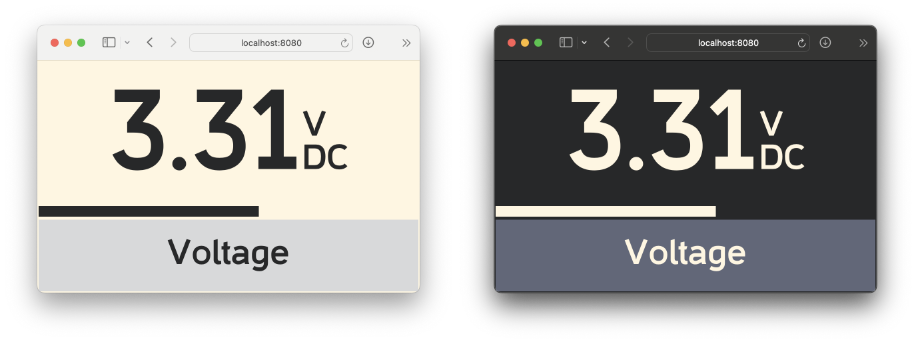

# ParksideWeb
ParksideWeb provides a lightweight and flexible read-out for Parkside PDM-300-C2 and PDM-300-C3 multimeters.
It supports both command-line and browser based operation and is the modern rewrite of ParksideView.



## Features
- Works on all major operating systems including Windows, Linux and macOS
- Big and resizable real-time browser display that should work in older browsers too
- Bargraph display that is scaled to the current range
- All readings are verified by checksum, magnitude and lifetime before being logged or shown
- Multiple devices can access readings at the same time and mobile devices can be used as wireless displays
- Other applications can retrieve live data through JSON via /config.json and /data.json
- CSV output of recording time, mode, percentage of range, value, unit (V/A/Ohm) and polarity (AC/DC)
- Duration of the acquisition can be limited, if desired
- Display and CSV translations available for German, English, French and Portuguese
- Automatic dark and light modes of the display included
- Embedded web-server and web-application in a self-contained ~8 MB executable
- Can be used from the command-line exclusively, if desired
- Browser can be opened automatically on the URL of the display
- Enumeration of all available serial ports and no parameters except port name/path required

## Usage
### Simple
`./ParksideWeb -p /dev/cu.usbmodem143301 -o`

Starts listening on the specified serial port and opens the display in your browser.

### Display and CSV
`./ParksideWeb -p /dev/cu.usbmodem143301 -o -c > output.csv`

As with 'Simple', but also records all valid readings in the specified CSV file.

### CSV only
`./ParksideWeb -p /dev/cu.usbmodem143301 -n -c > output.csv`

Records all valid readings in the specified CSV file and does not start the server.

### CSV with duration
`./ParksideWeb -p /dev/cu.usbmodem143301 -n -c -d 1m > output.csv`

As with 'CSV only', but stops recording after one minute.

### Custom port in background (e.g. for OBS or other interoperability)
`./ParksideWeb -p /dev/cu.usbmodem143301 -s 8080`

Starts the web-server on port 8080 instead of on a free port and does not open the browser.

### List serial ports
`./ParksideWeb -e`

Prints a list of all available serial ports.

## Hardware modifications
See <https://github.com/bmuessig/ParksideView> for more details on the simple modification required.

## Command-line
```
-b <int>        override the default serial port bitrate (default 2400)
-c              enable CSV output on standard output
-d <duration>   set an acquisition duration instead of endless (default endless)
-e              enumerate all serial ports then exit
-l en,de,pt,fr  language for CSV and display (default en)
-n              disable the HTTP server
-o              open the live display in a browser
-p <port name>  name or path of the serial port
-s <TCP port>   choose a static port number over a free port (default auto)
```
